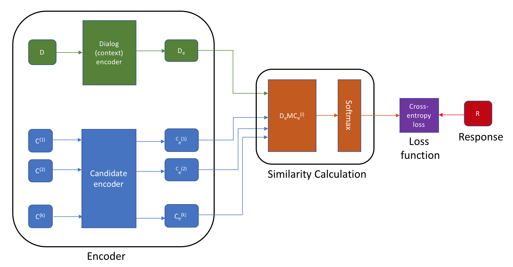

## Response Selection for Conversation Systems in Tensorflow

#### Overview
This code provides a baseline for the subtask 1 of DSTC-7 [Sentence Selection track](https://ibm.github.io/dstc7-noesis/public/index.html).

This code extends the work from Denny Britz which implements the Dual LSTM Encoder model from [The Ubuntu Dialogue Corpus: A Large Dataset for Research in Unstructured Multi-Turn Dialogue Systems](http://arxiv.org/abs/1506.08909)

[Refer to the original blog post here](http://www.wildml.com/2016/07/deep-learning-for-chatbots-2-retrieval-based-model-tensorflow)

#### Setup

This code uses Python 3.6 and Tensorflow-GPU 1.6. Clone the repository and install all required packages. It is recommended to use the [Anaconda package manager](https://www.anaconda.com/download/#macos). After installing Anaconda - 

```
cd noesis-tf
conda create --name dstc7 python=3.6
source activate dstc7
pip install -r ../requirements.txt
```

#### Get the data

Make sure you register for the track 1 of DSTC7 to download the data and copy it inside the `data` directory. 

#### Prepare the data

Before training, the data needs to converted to suitable format for tensorflow. The script `prepare_data.py` can be used to convert data from JSON format to TFRecords for subtasks 1 of both datasets. 

```
python scripts/prepare_data.py --train_in data/ubuntu_train_subtask_1.json --validation_in data/ubuntu_dev_subtask_1.json --train_out data/ubuntu_subtask_1.tfrecords --validation_out data/ubuntu_dev_subtask_1.tfrecords --vocab_path data/ubuntu_subtask_1.txt  --vocab_processor data/ubuntu_subtask_1.bin
```

#### Training

The following command can be used to train the model for the Ubuntu subtask 1. Similar command works for subtask 1 of Advising data as well.

```
python train.py --train_in data/ubuntu_subtask_1_new.tfrecords --validation_in data/ubuntu_dev_subtask_1.tfrecords -glove_path data/glove.42B.300d.txt -vocab_path data/ubuntu_subtask_1.txt --embedding_dim=300 --batch_size=16
```

The glove embeddings can be downloaded from [here](https://nlp.stanford.edu/projects/glove/)

Check `hparams.py` for all command-line arguments. 

#### Model

This baseline model extends the dual-encoder model used [here](http://www.wildml.com/2016/07/deep-learning-for-chatbots-2-retrieval-based-model-tensorflow). The architecture of the model is shown in the figure below. 


#### Dual Encoder Baselines (Recall)

Baselines are reported on validation set. 

| Dataset           | 1 in 100 R@1 | 1 in 100 R@2 | 1 in 100 R@5 | 1 in 100 R@10 | 1 in 100 R@50
| :---------------: | :-------------: | :--------------------: |:----------: | :---------: | :---------: |
| Ubuntu - Subtask 1 | 8.32% | 13.36% | 24.26% | 35.98% | 80.04% |
| Advising - Subtask 1 | 6.20% | 9.80% | 18.40% | 29.60% | 72.80% |

